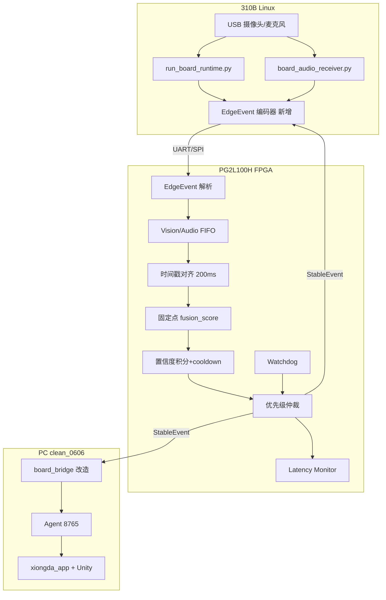

# FPGA 异构协同设计：AV-EventFusion 完整分析与改造清单

> **适用项目**：`clean_0606`（昇腾 310B + PG2L100H FPGA + Unity 熊大数字人）  
> **文档目的**：梳理现有代码不足、列出需修改/补充的完整清单、给出 PG2L100H 推荐方案，并汇总可借鉴的开源与竞赛参考。  
> **最后更新**：2026-07-14

---

## 目录

1. [项目当前基础条件](#1-项目当前基础条件)
2. [现有架构与数据流](#2-现有架构与数据流)
3. [六大结构性不足（代码级分析）](#3-六大结构性不足代码级分析)
4. [修改与补充完整清单](#4-修改与补充完整清单)
5. [为什么不建议 FPGA 直接接 USB 摄像头/麦克风](#5-为什么不建议-fpga-直接接-usb-摄像头麦克风)
6. [FPGA 推荐定位：AV-EventFusion 协处理器](#6-fpga-推荐定位av-eventfusion-协处理器)
7. [EdgeEvent 协议与现有 JSON 映射](#7-edgeevent-协议与现有-json-映射)
8. [FPGA 侧模块设计](#8-fpga-侧模块设计)
9. [在 clean_0606 中的插入点与改造路径](#9-在-clean_0606-中的插入点与改造路径)
10. [四阶段里程碑](#10-四阶段里程碑)
11. [推荐演示设计](#11-推荐演示设计)
12. [答辩创新点与表述](#12-答辩创新点与表述)
13. [开源 / 竞赛 / 产业参考项目清单](#13-开源--竞赛--产业参考项目清单)
14. [队友分工建议](#14-队友分工建议)
15. [关键代码路径速查](#15-关键代码路径速查)

---

## 1. 项目当前基础条件

本项目是基于 **昇腾 310B + PG2L100H FPGA + Unity 数字人** 的文旅交互系统。当前已有或正在做的部分包括：

```text
1. 摄像头接在 310B 上（UVC / V4L2 / OpenCV）
2. 麦克风接在 310B 上（ALSA）
3. 310B 负责视觉、语音、动作、表情等 AI 感知（NPU + CPU）
4. PC 端 board_bridge + Bear Agent + React 前端 + Unity WebGL
5. FPGA 型号：紫光同创 Logos-2 PG2L100H
6. 项目希望体现 310B 和 FPGA 的异构协同，而不是简单亮灯/蜂鸣器
```

**PG2L100H 合理定位**：

```text
确定性实时逻辑 / 事件流处理 / 时间戳对齐 / 固定点融合计算
状态机调度 / 安全回退 / 外设控制 / 低延迟协处理
```

**不是**：替代 310B 跑完整 AI 模型，也不是第一版就接 USB Host + UVC/UAC。

---

## 2. 现有架构与数据流

### 2.1 当前默认链路（clean_0606 已实现）

```text
板载 USB 摄像头 / 麦克风
  → run_board_runtime.py / board_audio_receiver.py（310B NPU + CPU）
  → TCP 18082（视觉 JSON + JPEG）/ 18083（ASR partial/segment）
  → board_bridge（PC Python 轮询合并）
  → Bear Agent :8765（LLM + 规则状态机 + MultimodalTurnGate）
  → xiongda_app :5173 → Unity WebGL（熊大 / 地图）
```

### 2.2 端口与关键目录

| 端口 | 方向 | 内容 |
|------|------|------|
| 18082 | 板→PC | 视觉 JSON + JPEG 预览 |
| 18083 | 板→PC | ASR partial / segment / state |
| 8765 | 本机 | Bear Agent HTTP API |
| 5173 | 本机 | React + Vite 前端 |

| 组件 | 路径 |
|------|------|
| 板端视觉+动作 | `pre_on_board_local_start_bundle/board_deploy/run_board_runtime.py` |
| 板端 ASR | `pre_on_board_local_start_bundle/board_deploy/board_audio_receiver.py` |
| PC 桥接 | `bear_agent/board_bridge/` |
| Agent 服务 | `bear_agent/integration_test/server.py` |
| 前端 | `xiongda_app/` |
| Unity 熊大 | `XiongdaUnityProject/` |
| Unity 地图 | `XiongdaParkMapProject/` |

### 2.3 FPGA 现状

**全库搜索 `FPGA` / `Verilog` / `VHDL` / `PG2L`：零实现。**

现有的 `fusion` 仅指：

- `bear_agent/perception.py` 的 `PerceptionFusion`（自然语言描述融合）
- `board_handoff.../fusion_result.json`（Ascend ATC 图编译产物，与事件融合无关）

---

## 3. 六大结构性不足（代码级分析）

### 不足 1：没有「候选事件 / 稳定事件」抽象，FPGA 无接口可接

310B 输出的是**聚合后的 `summary` 字典**，不是带 `event_id / modality / seq` 的事件流。

视觉侧典型结构（TCP 18082）：

```json
{
  "summary": {
    "person_count": 1,
    "top_gesture": { "label": "like", "confidence": 0.82 },
    "action": { "label": "hand_waving", "confidence": 0.70 },
    "top_emotion": { "label": "happy", "confidence": 0.90 }
  }
}
```

PC 侧 `board_bridge` 再合并成 Agent 的 `PerceptionPayload`，**全程没有 `CandidateEvent` / `StableEvent` 类型**。

**影响**：EdgeEvent 协议、FIFO、时间窗融合在代码里找不到对应数据结构；FPGA 需从零定义协议，并与现有 JSON 做映射层。

---

### 不足 2：多模态融合过于简单，且分散在三处 Python

| 层级 | 文件 | 策略 | 问题 |
|------|------|------|------|
| 板端 | `run_board_runtime.py` | 手势投票 `GESTURE_VOTE_WINDOW=7`、hold 0.55s、IOU 合并 | 只管视觉，不管语音 |
| PC | `perception_merge.py` | 视觉 vs ASR summary **同字段取 confidence 更高者** | 无时间戳对齐、无跨模态评分 |
| Agent | `multimodal_gate.py` | 软件串行闸门 + 90s watchdog | 管播放时序，不管感知融合 |

核心合并逻辑（`bear_agent/board_bridge/perception_merge.py`）：

```python
# 同字段多源：取 confidence 更高者
if la and lb:
    merged[key] = dict(a if conf(a) >= conf(b) else b)
```

**缺失能力**（展陈开放场景必需）：

- 200ms 音视时间窗匹配
- 音频峰值 + 视觉证据联合判定
- 噪声抑制（有声音但无人）
- 可配置 fusion_score 阈值与可观测 KPI

---

### 不足 3：时序与触发链路非确定性，延迟不可观测

`poll_loop.py` 用**文件轮询**驱动 Agent：

- `poll_interval_sec = 0.2`
- `min_post_interval_sec = 0.8`
- 默认触发 `speech_novelty`：仅 ASR 新 finalized 文本才 POST Agent

端到端路径：

```text
板端推理(~30fps) → TCP → 写 JSON → 轮询 200ms → 合并 → 等 speech → POST Agent → LLM → TTS → Unity
```

**缺失**：`t_event_receive / t_fusion_done / t_stable_out`、jitter、误触发率、噪声抑制次数等可展示指标。

---

### 不足 4：ASR 侧缺少结构化「语音事件」，置信度不完整

板端 CTC 流式 ASR 主要输出 `partial` / `segment_packet` 文本，**ASR confidence 常为 null**。

「你好 / 熊大」等关键词识别在 Agent 规则层，**不是板端候选事件**。GPT 方案中的 `VOICE_HELLO`、`AUDIO_PEAK`、`VAD_ACTIVE` 在现有 pipeline **无标准化输出**。

---

### 不足 5：躯体动作与手部手势语义分裂，Agent 可能屏蔽 body gesture

- ST-GCN 动作（`hand_waving`、`clapping` 等 8 类）与 MediaPipe 类手势（`like`、`peace`）映射到不同字段（`perception_from_board.py`）。
- Agent 默认可能屏蔽躯干 gesture（`BEAR_AGENT_PASS_BODY_GESTURE`）。

展陈演示「挥手 + 说你好 → 熊大欢迎」需**跨字段融合**，当前多依赖 LLM，非硬件级确认。

**ST-GCN 动作类别**（`motion/configs/holistic_stgcn_ntu8_board.yaml`）：

```text
cheering_up, hand_waving, bow, shake_head, jump_up, clapping, salute, taking_selfie
```

---

### 不足 6：与赛题「310B+FPGA 异构」对齐度不够

2026 集创赛华强×昇腾企业命题（公开解析）要求：

- 基于 **310B/310P 或 310B+FPGA** 异构平台
- 动作识别 + 表情捕捉 + 《熊出没》IP 沉浸式联动
- 适应开放园区（光照、人群、噪声）
- FPGA 可用于**图像前端预处理**或**多路融合**等

当前实现是 **310B → PC → Agent**，**FPGA 未出现在架构图、代码、指标里**。

---

## 4. 修改与补充完整清单

以下按 **优先级 P0→P3** 与 **负责侧** 列出，可直接作为任务分解表使用。

### 4.1 协议与数据模型（P0 — 阻塞 FPGA 接入）

| # | 任务 | 位置/新建 | 说明 | 状态 |
|---|------|-----------|------|------|
| 1 | 定义 `CandidateEvent` / `StableEvent` 数据结构 | 新建 `bear_agent/fpga_bridge/event_types.py` | 含 event_id, modality, confidence, ts_ms, value0/1, seq | ⬜ 待做 |
| 2 | 定义 EdgeEvent 二进制帧格式（16B） | 同上 + `docs/edge_event_spec.md` 或本文 §7 | SOF/CRC/EOF，禁止 JSON 进 FPGA | ⬜ 待做 |
| 3 | 事件 ID 枚举与现有 summary 字段映射表 | `fpga_bridge/event_map.py` | 见 §7.1 | ⬜ 待做 |
| 4 | Stable Event ID 与 Unity/Agent 动作映射 | `fpga_bridge/stable_event_map.py` | USER_GREETING → 挥手+欢迎词 | ⬜ 待做 |
| 5 | Schedule Command 结构体 | `fpga_bridge/schedule_cmd.py` | mode, target_fps, thresholds | ⬜ 待做 |

### 4.2 310B 侧：候选事件编码器（P0）

| # | 任务 | 位置/新建 | 说明 | 状态 |
|---|------|-----------|------|------|
| 6 | 从 `summary` 编码视觉候选事件 | `board_deploy/edge_event_encoder.py` | 每帧或每 N 帧 emit | ⬜ 待做 |
| 7 | ASR 关键词 → VOICE_HELLO 事件 | 同上或 `keyword_matcher.py` | 匹配「你好\|熊大\|嗨」 | ⬜ 待做 |
| 8 | 音频 RMS/峰值 → AUDIO_PEAK | `board_audio_receiver.py` 扩展 | 轻量 CPU，不必 NPU | ⬜ 待做 |
| 9 | VAD 状态 → VAD_ACTIVE 事件 | ASR 管线扩展 | 流式 VAD 布尔/置信度 | ⬜ 待做 |
| 10 | UART 发送候选事件 | `board_deploy/fpga_uart_bridge.py` | `/dev/ttyS*` 115200~921600 | ⬜ 待做 |
| 11 | 接收 FPGA schedule_cmd 并执行 | 同上 + `run_board_runtime.py` | 调 fps/模式环境变量或运行时参数 | ⬜ 待做 |
| 12 | 310B heartbeat 周期发送 | `fpga_uart_bridge.py` | FPGA watchdog 依赖 | ⬜ 待做 |

### 4.3 FPGA 侧：Verilog 实现（P0 — MVP）

| # | 任务 | 新建目录建议 | 说明 | 状态 |
|---|------|--------------|------|------|
| 13 | UART RX/TX（115200 起） | `fpga/rtl/uart/` | 可参考开源 UART IP | ⬜ 待做 |
| 14 | EdgeEvent 解析 FSM | `fpga/rtl/edge_parser.v` | S_IDLE→…→S_OUTPUT | ⬜ 待做 |
| 15 | Vision/Audio FIFO | `fpga/rtl/event_fifo.v` | 深度 32~64，CDC | ⬜ 待做 |
| 16 | 时间戳对齐（200ms 窗） | `fpga/rtl/timestamp_align.v` | abs(t_a-t_v) | ⬜ 待做 |
| 17 | 固定点 fusion_scorer | `fpga/rtl/fusion_scorer.v` | 整数加权，无浮点 | ⬜ 待做 |
| 18 | 置信度积分 + decay + cooldown | `fpga/rtl/score_accumulator.v` | 50ms tick | ⬜ 待做 |
| 19 | 优先级仲裁器 | `fpga/rtl/priority_arb.v` | safe_stop > greeting > wave… | ⬜ 待做 |
| 20 | Watchdog + SAFE_IDLE | `fpga/rtl/watchdog.v` | 2s 无 heartbeat | ⬜ 待做 |
| 21 | Latency Monitor 计数器 | `fpga/rtl/latency_monitor.v` | 可读寄存器 | ⬜ 待做 |
| 22 | schedule_cmd 生成 | `fpga/rtl/schedule_gen.v` | 反向调度 310B | ⬜ 待做 |
| 23 | 顶层 + 约束 + PDS 工程 | `fpga/pds/` | PG2L100H 管脚 | ⬜ 待做 |

### 4.4 软件黄金模型（P0 — 与 Verilog 对齐，可先不烧 FPGA）

| # | 任务 | 位置/新建 | 说明 | 状态 |
|---|------|-----------|------|------|
| 24 | Python 版 fusion/accumulator/arb | `bear_agent/fpga_bridge/fusion_sim.py` | 与 RTL 同算法，golden model | ⬜ 待做 |
| 25 | 测试向量生成 | `bear_agent/fpga_bridge/tests/test_vectors.json` | 挥手+你好等场景 | ⬜ 待做 |
| 26 | A/B 对比脚本 | `bear_agent/fpga_bridge/benchmark_ab.py` | Baseline merge vs FPGA-sim | ⬜ 待做 |
| 27 | 误触发/噪声抑制计数 | benchmark 输出 | 答辩 KPI | ⬜ 待做 |

### 4.5 PC 侧：board_bridge 改造（P1）

| # | 任务 | 位置 | 说明 | 状态 |
|---|------|------|------|------|
| 28 | 读取 stable event（文件或 TCP 旁路） | `board_bridge/stable_event_sink.py` | 新输入源 | ⬜ 待做 |
| 29 | stable event → perception 或直接触发 | `poll_loop.py` 改造 | 减少 LLM 误触发依赖 | ⬜ 待做 |
| 30 | 新增触发模式 `stable_event` | `config.py` | 与 speech_novelty 并存 | ⬜ 待做 |
| 31 | 延迟/KPI 日志 | `latency` 或新 log | fusion_delay_ms 等 | ⬜ 待做 |
| 32 | FPGA 统计寄存器 UART 读出工具（PC） | `fpga_bridge/stats_reader.py` | 调试/答辩 | ⬜ 待做 |

### 4.6 前端 / Unity（P1）

| # | 任务 | 位置 | 说明 | 状态 |
|---|------|------|------|------|
| 33 | StableEvent 类型定义 | `xiongda_app/src/bear_pipeline/` | TS 类型 | ⬜ 待做 |
| 34 | 可选：stable event 直连 Unity 动作 | `handleBearAgentPayload.ts` | 低延迟路径 | ⬜ 待做 |
| 35 | 答辩 KPI 展示面板 | 新组件或 SmartParkTheaterPanel | 实时指标 | ⬜ 待做 |

### 4.7 Agent 层（P2 — 可选优化）

| # | 任务 | 位置 | 说明 | 状态 |
|---|------|------|------|------|
| 36 | perception 增加 `stable_event` 字段 | `schemas.py` / `bearAgentTypes.ts` | Agent 知悉硬件决策 | ⬜ 待做 |
| 37 | 有 stable_event 时 LLM 只生成台词 | `agent.py` 规则 | 触发权交给 FPGA | ⬜ 待做 |
| 38 | 恢复 body gesture 传递（演示需要） | 环境变量/配置 | 与 FPGA 挥手事件一致 | ⬜ 待做 |

### 4.8 通信与硬件联调（P1→P2）

| # | 任务 | 说明 | 状态 |
|---|------|------|------|
| 39 | 第一版：310B UART ↔ FPGA UART | 最简单联调 | ⬜ 待做 |
| 40 | 第二版：SPI 或 UDP（可选） | 事件量增大时 | ⬜ 待做 |
| 41 | 第三版：PCIe Gen2 x4（展望） | PG2L100H 硬核 PCIe，答辩路线图 | ⬜ 待做 |
| 42 | FPGA 远程升级流程文档 | 310B+FPGA 算力盒常见能力 | ⬜ 待做 |

### 4.9 扩展方向（P3 — 给队友，非主线）

| # | 任务 | 说明 | 状态 |
|---|------|------|------|
| 43 | FPGA DVP/MIPI 运动检测 + ROI | 不做 USB Host，只出 ROI 事件 | ⬜ 可选 |
| 44 | I2S/PDM 麦克风 → 音频峰值/VAD 粗判 | 替代 USB 麦克风接 FPGA | ⬜ 可选 |
| 45 | Ascend C VideoPreFuse 算子 | 310B 侧预处理优化 | ⬜ 可选 |
| 46 | 多路视频融合（赛题提及） | 第二摄像头/HDMI in | ⬜ 可选 |

### 4.10 文档与答辩（P1）

| # | 任务 | 位置 | 状态 |
|---|------|------|------|
| 47 | 架构图（310B↔FPGA 双向） | 本文 + PPT | ✅ 本文 |
| 48 | 演示脚本 4 场景 | §11 | ✅ 本文 |
| 49 | Baseline vs Ours 指标表模板 | `docs/fpga_demo_metrics.md` | ⬜ 待做 |
| 50 | README 增加 FPGA 文档链接 | `README.md` | ⬜ 待做 |

---

## 5. 为什么不建议 FPGA 直接接 USB 摄像头/麦克风

### 5.1 USB 摄像头不是简单像素流

普通 USB 摄像头走 UVC 协议，链路包括：USB Host 枚举 → UVC descriptor → 格式协商 → isochronous/bulk 传输 → MJPEG/H.264 解码 → 帧缓存 → 回传 310B。

FPGA 直接接 USB 摄像头需解决 USB Host PHY/IP、UVC 解析、帧缓存、**高带宽回传 310B**（720p@30 约 55~83 MB/s，UART 无法承载）。

### 5.2 USB 麦克风走 UAC，同样复杂

UAC 描述符、采样率协商、isochronous 音频包、时钟漂移、PCM 重组。若只需峰值/VAD，**I2S/PDM/ADC 麦克风接 FPGA** 更合理。

### 5.3 当前更合理的输入方式

```text
USB 摄像头 / USB 麦克风 → 310B Linux（UVC/ALSA/OpenCV/CANN）
→ 视觉/语音/动作 AI 推理 → 候选事件 → FPGA 融合调度
```

**不推荐主线**：

```text
USB 摄像头/麦克风 → FPGA → 310B
```

**推荐主线**：

```text
USB 摄像头/麦克风 → 310B → 事件/特征 → FPGA
```

---

## 6. FPGA 推荐定位：AV-EventFusion 协处理器

### 6.1 不要把 FPGA 当成外设亮灯板

```text
310B 识别 event_id=1 → FPGA 点亮 LED   ❌ 技术含量不足
```

### 6.2 推荐定义

```text
AV-EventFusion FPGA
面向 310B 的音视多模态事件融合与自适应推理调度协处理器
```

> **310B** 负责「看见、听见、初步判断」；**PG2L100H** 负责「对齐、融合、确认、调度、监控、安全回退」。

### 6.3 总体架构

```text
USB 摄像头 / USB 麦克风
        ↓
310B：音视频采集、AI 推理、Ascend C 自定义算子（可选）
        ↓
候选事件 Candidate Events（二进制 EdgeEvent）
        ↓
PG2L100H FPGA：
    事件协议解析 / 时间戳对齐 / 音视事件融合 / 置信度积分
    连续帧投票 / 优先级仲裁 / 自适应推理调度 / Watchdog / 延迟监控
        ↓
Stable Event + Schedule Command
        ↓
board_bridge / Unity 熊大动作 / 表情 / 语音回应
```



---

## 7. EdgeEvent 协议与现有 JSON 映射

### 7.1 候选事件 ID（与 clean_0606 代码对应）

| event_id | 名称 | 310B 产生条件 |
|----------|------|---------------|
| 0x01 | USER_APPEAR | `summary.person_count > 0` |
| 0x02 | GESTURE_WAVE | `action.label == hand_waving` 或 `wave_hand` |
| 0x03 | ACTION_CLAP | `action.label == clapping` |
| 0x04 | HAND_LIKE | `top_gesture.label == like` |
| 0x05 | FACE_HAPPY | `top_emotion.label == happy` |
| 0x06 | AUDIO_PEAK | RMS/峰值 > 阈值（新增） |
| 0x07 | VAD_ACTIVE | 流式 VAD（新增） |
| 0x08 | VOICE_HELLO | ASR 匹配「你好\|熊大\|嗨」（新增） |
| 0x09 | CROWD_DENSE | `summary.crowding.crowded == true` |

### 7.2 稳定事件 ID（FPGA 输出）

| stable_id | 名称 | 融合规则 |
|-----------|------|----------|
| 0x81 | USER_GREETING | GESTURE_WAVE + VOICE_HELLO，Δt<200ms，score>850 |
| 0x82 | ATTENTION | USER_APPEAR + AUDIO_PEAK |
| 0x83 | NOISE_SUPPRESSED | AUDIO_PEAK 高但无 USER_APPEAR |
| 0x84 | CLAP_CONFIRMED | ACTION_CLAP 积分超阈值 + cooldown |
| 0x85 | SAFE_IDLE | watchdog：2s 无 heartbeat |

### 7.3 二进制帧格式（16 字节，UART 友好）

```text
SOF(1) | seq(2) | modality(1) | event_id(1) | conf(1,0~100) | v0(2) | v1(2) | ts_ms(4) | crc8(1) | EOF(1)
0xAA   | u16 LE | 0=V 1=A     | u8          | u8            | i16   | i16   | u32 LE  | crc     | 0x55
```

- `v0/v1`：bbox 中心 x/y 或 audio_peak 值
- **禁止 JSON 进 FPGA**（与 `stream_protocol.py` 的大 JSON 分离）

### 7.4 融合公式（Verilog 整数版）

送入 FPGA 前 confidence ×100：

```text
sync_score = max(0, 100 - |t_a - t_v| * 100 / 200)
fusion_score = 5*vision_conf + 4*audio_conf + 3*sync_score
trigger if fusion_score >= 850
```

**示例**：vision_conf=72, audio_conf=86, Δt=37ms → score≈947 → USER_GREETING

### 7.5 310B 侧 JSON 候选事件示例（软件层，供编码器输入）

```json
{
  "frame_id": 1024,
  "modality": "vision",
  "event_id": 2,
  "event_name": "gesture_wave",
  "confidence": 72,
  "x": 61,
  "y": 44,
  "timestamp_ms": 128034
}
```

```json
{
  "frame_id": 1025,
  "modality": "audio",
  "event_id": 8,
  "event_name": "voice_hello",
  "confidence": 86,
  "audio_peak": 91,
  "timestamp_ms": 128071
}
```

---

## 8. FPGA 侧模块设计

| 模块 | 功能 | 技术要点 |
|------|------|----------|
| `uart_rx/tx` | 与 310B 互联 | 第一版 UART 115200~921600 |
| `edge_parser_fsm` | 解析 EdgeEvent | 状态机，CRC 校验 |
| `vision_fifo` / `audio_fifo` | 事件缓冲 | 深度 32~64，CDC |
| `timestamp_align` | 200ms 窗口 | 绝对值比较 |
| `fusion_scorer` | 加权求和 | shift-add，无浮点 |
| `score_accumulator` | 积分+衰减 | 50ms tick，decay=20 |
| `priority_arb` | 7 级优先级 | safe_stop > leave > click > greeting… |
| `schedule_gen` | 反向调度 | mode/fps/threshold → 310B |
| `watchdog` | heartbeat 2s | SAFE_IDLE |
| `latency_cnt` | 周期计数 | fusion_delay_ms 等 |

### 8.1 反向调度与 310B 挂钩

| FPGA schedule_cmd | 310B 侧动作 |
|-------------------|-------------|
| MODE_IDLE, fps=2 | 降低 `run_board_runtime` 推理频率 |
| MODE_APPROACH, fps=10 | 提高 person 检测 duty |
| MODE_AUDIO_PRIORITY | ASR 优先，视觉降频 |
| MODE_GESTURE_PRIORITY | ST-GCN 窗口加长 |
| MODE_SAFE_FALLBACK | 停止 stable_event 上报 |

### 8.2 优先级示例

```text
safe_stop       priority = 7
user_leave      priority = 6
hand_click      priority = 5
user_greeting   priority = 4
gesture_wave    priority = 3
face_smile      priority = 2
idle_motion     priority = 1
```

### 8.3 置信度积分规则示例

```text
wave_score += confidence
每 50ms: score -= decay (decay=20)
trigger_threshold = 180
cooldown = 500ms
```

---

## 9. 在 clean_0606 中的插入点与改造路径

### 9.1 最自然插入点

**方案 A（推荐）**：310B 输出 raw candidates（UART）→ FPGA → stable events → 替换/增强 `board_bridge.build_perception()` 触发逻辑

**方案 B（最小改动）**：FPGA 在 310B 与 PC 之间做 summary 级融合，仍输出 `latest_*.json` 格式

### 9.2 第一版 MVP 范围

**不做**：ROI 全链路、USB 摄像头接 FPGA、PCIe 视频 DMA

**优先完成**：

```text
1. 310B 生成模拟/真实候选事件
2. 事件通过 UART 发给 FPGA（或 Python golden sim）
3. FPGA 解析 EdgeEvent
4. 时间窗匹配 + fusion_score
5. confidence accumulator
6. 输出 stable_event
7. 返回 schedule_cmd
8. Unity / board_bridge 根据 stable_event 响应
```

**第一版事件类型（4 候选 + 3 稳定）**：

候选：`GESTURE_WAVE`, `VOICE_HELLO`, `AUDIO_PEAK`, `USER_APPEAR`

稳定：

```text
USER_GREETING = GESTURE_WAVE + VOICE_HELLO
ATTENTION     = USER_APPEAR + AUDIO_PEAK
NOISE_SUPPRESSED = AUDIO_PEAK without USER_APPEAR
```

---

## 10. 四阶段里程碑

| 阶段 | 周期 | 交付物 |
|------|------|--------|
| **第 1 周** | 软件黄金模型 | `fpga_bridge/fusion_sim.py`、测试向量、A/B benchmark |
| **第 2 周** | 310B↔FPGA UART | encoder + RTL parser/fusion MVP + stable event 落盘 |
| **第 3 周** | 演示对齐赛题 | 4 场景脚本 + KPI 采集 |
| **第 4 周** | 答辩材料 | 架构图、指标表、示波器/寄存器截图、Related Work |

---

## 11. 推荐演示设计

### 演示 1：音视融合问候

- **操作**：挥手 + 说「熊大你好」
- **310B**：gesture_wave conf=72 @128034ms；voice_hello conf=86 @128071ms
- **FPGA**：Δt=37ms，fusion_score=947 > 850 → `USER_GREETING`
- **Unity**：熊大挥手 + 欢迎词

### 演示 2：噪声抑制

- **输入**：环境噪声/拍手，画面无人
- **FPGA**：audio_peak 高 + vision 缺失 → `NOISE_SUPPRESSED`，不触发动作

### 演示 3：模型抖动稳定

- **输入**：手部边缘晃动，wave_conf 不稳定
- **对比**：Baseline（Python merge）误触发 vs FPGA 积分稳定后触发

### 演示 4：自适应推理调度

- **状态**：无人 → 靠近 → 对话 → 低置信度 → 异常
- **展示**：schedule_switch_count、NPU 帧率变化、误触发下降

### 可展示 KPI

```text
fusion_delay_ms / stabilization_ms / e2e_ms / jitter_ms
false_trigger_count / noise_suppressed_count / schedule_switch_count / watchdog_count
```

---

## 12. 答辩创新点与表述

### 12.1 四个硬创新点

1. **双向异构闭环**：310B 候选事件 ↔ FPGA 调度命令，非单向「识别→亮灯」
2. **硬件级多模态融合**：替代 `perception_merge.py` 的 max-confidence，可形式化验证
3. **展陈级抗噪与防误触**：积分 + cooldown + NOISE_SUPPRESSED，对应开放园区赛题
4. **可观测实时性**：FPGA 寄存器输出 delay/jitter/误触发计数

### 12.2 与竞争对手「波峰合成」的差异化

```text
竞争对手：单模态音频波峰 → 触发
我们：audio_peak + voice_hello + gesture_wave + timestamp → FPGA 融合 → user_greeting
```

### 12.3 推荐答辩表述（可直接使用）

> 我们没有把 PG2L100H FPGA 简单作为灯光或蜂鸣器控制器，而是将其设计为面向昇腾 310B 的实时事件融合与推理调度协处理器。摄像头和麦克风由 310B 采集，310B 利用 NPU 完成视觉、语音和动作感知，输出带有置信度和时间戳的候选事件；FPGA 接收这些事件后，在硬件侧完成协议解析、200ms 音视对齐、固定点融合评分、置信度积分、优先级仲裁、watchdog 安全回退和延迟监控，并反向向 310B 下发推理模式控制。系统从「Python 轮询合并 + LLM 触发」升级为「NPU 复杂感知 + FPGA 确定性融合 + Unity 数字人表现」的国产异构闭环。

### 12.4 最终推荐结论

**最推荐主线**：

```text
摄像头/麦克风 → 310B AI 感知 → PG2L100H 事件融合/调度/安全 → Unity 表现
```

**不推荐主线**：

```text
USB 摄像头/麦克风 → PG2L100H → 310B（除非已有 USB Host + 高速回传全套能力）
```

---

## 13. 开源 / 竞赛 / 产业参考项目清单

以下按 **与本项目的关联度** 分类，便于 FPGA/310B/融合各方向查阅。

### 13.1 本项目已集成的开源（310B / 感知侧）

| 项目 | 链接 | 可借鉴点 |
|------|------|----------|
| **k2-fsa / sherpa-onnx** | https://github.com/k2-fsa/sherpa-onnx | 流式 CTC ASR；partial → 事件化思路 |
| **ST-GCN / NTU RGB+D** | 论文 + 本仓库 `holistic_stgcn_ntu8_board.yaml` | 8 类动作 benchmark 背书 |
| **MediaPipe** | Google MediaPipe | 手势 taxonomy；`gesture_cursor_project` 实验参考 |
| **CosyVoice** | 本地 `cosyvoice_live_release/` | TTS 链路（与 FPGA 无直接耦合） |
| **Paraformer / ModelScope** | ModelScope | 备选 ASR backend |

### 13.2 UART / 串口协议（FPGA 第一版互联 — 直接可用）

| 项目 | 链接 | 语言 | 可借鉴点 |
|------|------|------|----------|
| **jakubcabal/uart-for-fpga** | https://github.com/jakubcabal/uart-for-fpga | VHDL | MIT；参数化波特率；含 loopback 与 Wishbone 桥 |
| **LasiduDilshan/UART-using-Verilog** | https://github.com/LasiduDilshan/UART-using-Verilog | Verilog | TX/RX/baud 模块 + testbench，入门清晰 |
| **pabennett/uart** | https://github.com/pabennett/uart | VHDL | 115200@100MHz loopback；ChipTools 流程 |
| **ttsiodras/UART_in_VHDL** | https://github.com/ttsiodras/UART_in_VHDL | VHDL | 含 FIFO、全速 sync 经验 |
| **AlexFoisy/oUART** | https://github.com/AlexFoisy/oUART | Verilog | 轻量 UART 收发 |

**用法建议**：PG2L100H 开发板通常自带 USB-UART（CH340/CP2102），先用厂商 **PDS UART 例程** 跑通 115200，再替换为自定义 EdgeEvent 帧 parser。

### 13.3 传感器融合 + UART 主机通信（架构模式参考）

| 项目/论文 | 链接 | 可借鉴点 |
|-----------|------|----------|
| **FPGA Kalman + UART（IJEECS）** | https://doi.org/10.11591/ijeecs.v34.i2.pp888-899 | Python 黄金模型 ↔ Vivado HLS ↔ UART 大端字节序；**与 fusion_sim + RTL 验证流程同构** |
| **AquaFusion Sonar+Vision** | https://github.com/DavidRichardson02/AquaFusion_Sonar_Vision_System_Phase_4 | Verilog；camera+sonar+UART telemetry+HUD；**多模态快照与 CDC** |
| **FPGA-Accelerated Autonomous Rover** | https://github.com/sskonda/FPGA-Accelerated-Autonomous-Rover | Zynq；vision+sonar+IMU 任务划分；**UART 集中日志、多传感器 FreeRTOS 任务** |

### 13.4 事件驱动 / 稀疏事件 FPGA（控制 FSM 与调度参考）

| 项目 | 链接 | 可借鉴点 |
|------|------|----------|
| **event-driven-cnn-FPGA** | https://github.com/supriyarl/event-driven-cnn-FPGA | Event Scheduler + PE + FSM；**Python 测试向量 + Verilog**；UART 实时流 |
| **gcnn-dvs-fpga** | https://github.com/vision-agh/gcnn-dvs-fpga | 事件相机 GCNN；**事件-by-event 流水线** |
| **Event-Driven SNN Accelerator** | https://github.com/metr0jw/Event-Driven-Spiking-Neural-Network-Accelerator-for-FPGA | `event_router` 轮询仲裁、FIFO backpressure、固定点 |
| **HESP-Stream（论文）** | IEEE FCCM 2026 | 传感器直连 FPGA、稀疏事件、端到端延迟 KPI |

**用法建议**：不照搬 CNN PE，而是借鉴 **Event Scheduler / Router / Valid-Ready 握手 / 稀疏队列** 做 EdgeEvent 调度。

### 13.5 软核 + 寄存器桥（可选：FPGA 内嵌 MCU 读 stats）

| 项目 | 链接 | 可借鉴点 |
|------|------|----------|
| **PicoRV32** | https://github.com/YosysHQ/picorv32 | 极小 RISC-V，可通过 UART 读 latency 寄存器 |
| **LiteX** | https://github.com/enjoy-digital/litex | 生成 SoC + UART/SPI；PG2L 需评估兼容性 |
| **ZipCPU** | http://www.opencores.org/projects/zipcpu | 开源 CPU + 外设总线范例 |

**用法建议**：MVP 不必上软核；答辩版可用 **纯状态机 + UART 寄存器读** 即可。

### 13.6 多模态时间对齐（软件对标 → 硬件化）

| 项目 | 链接 | 可借鉴点 |
|------|------|----------|
| **ROS2 message_filters** | https://github.com/ros2/message_filters | `ApproximateTime` 同步策略 → **200ms fusion_window 的软件参考** |
| **ROS2 robot_state_publisher** | ROS 生态 | 多源 timestamp 对齐模式 |

### 13.7 紫光 PG2L100H / 国产 FPGA 官方与社区

| 资源 | 链接 | 说明 |
|------|------|------|
| **紫光同创开放平台** | https://www.pangomicro.com/open/2530.html | PG2L Demo 板：USB-UART、PCIe x4、DDR3、DVP 等 |
| **Pango Design Suite (PDS)** | 厂商安装包 | Logos-2 综合/implement 唯一官方工具链 |
| **米尔 MYC-J2L100H** | https://www.myir.cn/product/som/logos2/myc-j2l100h.html | 512MB DDR3、PCIe、千兆网、DVP 摄像头口 |
| **盘古100K / 小眼睛 PG2L100H** | CSDN / 小眼睛社区 | HDMI/DVP/PCIe 例程与实战笔记 |
| **米尔论坛 UART 测试帖** | https://bbs.elecfans.com/jishu_2467589_1_1.html | PG2L100H 115200 8N1 实测流程 |

### 13.8 昇腾 310B + FPGA 异构（赛题与产业对标）

| 资源 | 链接 | 说明 |
|------|------|------|
| **2026 集创赛华强×昇腾企业命题** | 公开赛题解析 | 310B+FPGA、熊出没 IP、动作表情、开放场景 |
| **昇腾310B + PG2L200H 算力盒** | 电子发烧友 / 小眼睛 | PCIe 互联、FPGA 前端采集叙事、固件远程升级 |
| **华为 Ascend CANN / ais_bench** | 本仓库 `docs/BOARD.md` | 310B 推理与 OM 部署（已在用） |

### 13.9 Python↔FPGA 协同验证（与本项目 golden model 同构）

| 做法 | 参考 | 说明 |
|------|------|------|
| **cocotb** | https://github.com/cocotb/cocotb | Python testbench 驱动 Verilog，与 `fusion_sim.py` 对比 |
| **Verilator + Python** | https://www.veripool.org/verilator/ | 快速协同仿真 |
| **pyserial 帧注入** | PySerial 文档 | PC 模拟 310B 向 FPGA 灌 EdgeEvent 测试向量 |

### 13.10 不建议作为第一版主线的参考

| 方向 | 原因 |
|------|------|
| USB Host + UVC on FPGA | 工程量大，与现有 310B UVC 链路重复 |
| 完整 PCIe DMA 视频 | 需驱动与内存映射，超出 MVP |
| 大型 SoC（Zynq）工程直接移植 | PG2L100H 无 ARM 核，仅借鉴 RTL 模块 |

---

## 14. 队友分工建议

| 角色 | 主线任务 | 扩展（可选） |
|------|----------|--------------|
| **310B** | EdgeEvent 编码、keyword/VAD/peak、schedule_cmd 执行 | Ascend C VideoPreFuse |
| **FPGA** | Parser + Fusion + Accumulator + Arb + Watchdog + Latency | DVP 运动 ROI（非 USB Host） |
| **PC/Agent** | stable event 消费、board_bridge 改造、KPI 日志 | Agent 只生成台词 |
| **Unity/前端** | stable_event 触发动画、答辩指标面板 | 地图页与问候分离 |
| **已做 USB→FPGA 的同学** | 收敛为 ROI/运动事件扩展 | 不阻塞主线 UART 融合 |

---

## 15. 关键代码路径速查

| 主题 | 路径 |
|------|------|
| 视觉+动作运行时 | `pre_on_board_local_start_bundle/board_deploy/run_board_runtime.py` |
| ASR 运行时 | `pre_on_board_local_start_bundle/board_deploy/board_audio_receiver.py` |
| TCP 协议 | `pre_on_board_local_start_bundle/board_deploy/stream_protocol.py` |
| PC 视觉/ASR 合并 | `bear_agent/board_bridge/perception_merge.py` |
| 标签映射 | `bear_agent/board_bridge/perception_from_board.py` |
| 轮询触发 | `bear_agent/board_bridge/poll_loop.py` |
| 桥接配置 | `bear_agent/board_bridge/config.py` |
| 多模态闸门 | `bear_agent/integration_test/multimodal_gate.py` |
| Agent 类型 | `xiongda_app/src/bear_pipeline/bearAgentTypes.ts` |
| ST-GCN 配置 | `pre_on_board_local_start_bundle/motion/configs/holistic_stgcn_ntu8_board.yaml` |
| 一键启动（板+PC） | `pre_on_board_local_start_bundle/run_all.py` |
| PC 文档 | `docs/PC.md` |
| 板端文档 | `docs/BOARD.md` |

---

## 附录 A：现状 vs 目标对照表

| 维度 | 现状（clean_0606） | FPGA 方案应补什么 |
|------|-------------------|-------------------|
| 事件模型 | 无，仅 summary JSON | EdgeEvent + StableEvent |
| 融合 | Python max-conf，三处分散 | FPGA 固定点融合 + 积分 |
| 时序 | 200ms 轮询 + 800ms 节流 | μs 级确定性 + 延迟计数 |
| ASR 事件 | 仅文本，无 conf | VAD/peak/keyword 事件化 |
| 异构叙事 | 310B 单核 | 310B↔PG2L100H 双向 UART/PCIe |
| 赛题对齐 | 功能有，FPGA 无 | 异构 + 开放场景 KPI |
| 开源参考 | ASR/动作已有 | §13 UART/融合/事件驱动 FPGA |

---

## 附录 B：相关文档

- [README.md](../README.md) — 项目总览
- [docs/PC.md](PC.md) — PC 启动与 board_bridge
- [docs/BOARD.md](BOARD.md) — 310B 板端部署

---

*文档维护：FPGA/310B 联调进展更新时，请同步 §4 清单中的「状态」列。*
