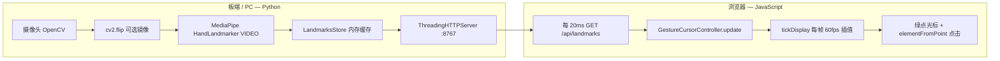

# gesture_cursor_project — 完整技术规格（供 Codex / AI 助手理解）

> **本文档是手势虚拟光标模块的权威说明。**  
> 修改算法、部署板端、接入熊大前端前，请先读本文。

---

## 1. 系统目标

用手势在**浏览器网页**上控制虚拟光标：

- **移动**：手在摄像头前移动 → 网页上出现绿点光标跟随
- **点击**：拇指 + 食指捏合并保持约 200ms → 触发光标下方可交互元素的点击

**不是** Unity 编辑器内光标；Unity WebGL 仅作为页面内 canvas 时，点击可转发给 Unity。

---

## 2. 总体架构



### 2.1 职责分离

| 层 | 语言 | 职责 |
|----|------|------|
| **感知层** | Python | 摄像头采集、手部 21 关键点检测、HTTP 推送 |
| **交互层** | JavaScript | 坐标映射、平滑滤波、捏合判定、DOM 点击、光标渲染 |
| **集成层** | TypeScript/React | `xiongda_app` 中复用同一套 JS 逻辑，数据来自 `board_bridge` perception |

**关键设计**：Python 只输出原始 `hand_landmarks`；所有光标行为逻辑在浏览器端，便于调参且与板端解耦。

---

## 3. 目录结构

```text
f:\jichuang2026\gesture_cursor_project\
  CODEX_SPEC.md              # 本文件（权威规格）
  README.md                  # 用户快速上手
  python/
    config.py                # 环境变量、路径、模型 URL
    hand_tracker.py          # MediaPipe HandLandmarker 封装
    landmarks_server.py      # HTTP 服务 + LandmarksStore
    run_local_demo.py        # PC 测试（摄像头预览 + 自动开浏览器）
    run_board.py               # 板端（默认无预览）
    run_local_demo.ps1         # 一键启动（自动用正确 venv）
    requirements.txt
  web/
    index.html                 # 独立测试页
    cursor_controller.js       # 核心光标逻辑（源真相）
    one_euro_filter.js         # 1€ 滤波器
  models/
    hand_landmarker.task       # 首次运行自动下载
```

### 3.1 关联目录（仓库其他位置）

| 路径 | 关系 |
|------|------|
| `f:\jichuang2026\2026--\gesture_project\venv` | **唯一推荐 Python 虚拟环境**（含 mediapipe、opencv、torch） |
| `f:\jichuang2026\xiongda_app\src\gesture_cursor\` | React 集成层，逻辑与 `cursor_controller.js` 对齐 |
| `f:\jichuang2026\gesture_cursor_quicktest.py` | 快捷入口，转发到 `run_local_demo.py` |
| `f:\jichuang2026\bear_agent\board_bridge\` | 板端 perception 管道（**待接入** `hand_landmarks`） |

---

## 4. 运行方式

### 4.1 虚拟环境（必须）

```powershell
# 手势相关 Python 统一用这个 venv
f:\jichuang2026\2026--\gesture_project\venv
```

不要用 `bear_agent\.venv`（无 mediapipe），不要用根目录 `gesture_project\venv`（不存在）。

### 4.2 PC 本地测试

```powershell
cd f:\jichuang2026\gesture_cursor_project\python
.\run_local_demo.ps1
# 或
f:\jichuang2026\2026--\gesture_project\venv\Scripts\python.exe run_local_demo.py
```

- 浏览器：`http://127.0.0.1:8767/`
- OpenCV 预览窗口：ESC 退出

### 4.3 板端部署

```powershell
python run_board.py --host 0.0.0.0 --port 8767 --no-preview
```

局域网设备浏览器访问：`http://<板子IP>:8767/`

---

## 5. Python 后端规格

### 5.1 `config.py` — 环境变量

| 变量 | 默认值 | 含义 |
|------|--------|------|
| `GESTURE_CURSOR_HOST` | `127.0.0.1` | HTTP 监听地址 |
| `GESTURE_CURSOR_PORT` | `8767` | HTTP 端口 |
| `GESTURE_CURSOR_CAMERA` | `0` | 摄像头索引 |
| `GESTURE_CURSOR_NO_PREVIEW` | 关 | `1`/`true` 强制无 OpenCV 预览 |
| `GESTURE_CURSOR_MIRROR` | 开 | `0`/`false` 关闭水平 flip |

### 5.2 CLI 参数

**`run_local_demo.py`**

| 参数 | 默认 | 说明 |
|------|------|------|
| `--host` | config | HTTP 地址 |
| `--port` | config | HTTP 端口 |
| `--camera` | config | 摄像头索引 |
| `--no-browser` | 关 | 不自动打开浏览器 |
| `--no-mirror` | 关 | 不 `cv2.flip`；左右反了时尝试 |

**`run_board.py`**

| 参数 | 默认 | 说明 |
|------|------|------|
| `--host` | config | 板端建议 `0.0.0.0` |
| `--port` | config | 端口 |
| `--camera` | config | 摄像头 |
| `--preview` | 关 | 显示 OpenCV 预览 |
| `--no-preview` | 关 | 强制无预览 |
| `--no-mirror` | 关 | 不 flip |

### 5.3 `hand_tracker.py` — MediaPipe 封装

**模型**：`hand_landmarker/float16/1/hand_landmarker.task`（Google 官方，自动下载到 `models/`）

**运行模式**：`RunningMode.VIDEO`（必须每帧传入**严格递增**的毫秒时间戳）

**构造参数**：

| 参数 | 默认值 | 说明 |
|------|--------|------|
| `max_num_hands` | `1` | 只跟踪一只手 |
| `min_detection_confidence` | `0.65` | 检测置信度 |
| `min_tracking_confidence` | `0.7` | 跟踪置信度 |

**时间戳**：`_next_frame_ms()` 保证 `frame_ms = max(elapsed_ms, last_ms + 1)`，避免 `ValueError: Input timestamp must be monotonically increasing`。

**输入**：BGR 帧（`numpy` array，OpenCV 格式）

**输出**：`List[dict]`，21 个元素，每只手的第一只：

```python
[{"x": 0.52, "y": 0.41, "z": -0.03}, ...]  # 无手时 []
```

- `x`, `y`：归一化坐标 **0.0 ~ 1.0**（相对图像宽高）
- `z`：相对深度（可为负）

**镜像**：在 `run_*.py` 中 `cv2.flip(frame, 1)` 后再送入 `process_bgr`；landmark 坐标已是镜像后图像的坐标。

### 5.4 `landmarks_server.py` — HTTP 服务

**线程模型**：`ThreadingHTTPServer` 在后台 daemon 线程；主线程跑摄像头循环写 `LandmarksStore`。

**路由**：

| 方法 | 路径 | 响应 |
|------|------|------|
| GET | `/` | `web/index.html` |
| GET | `/api/landmarks` | JSON（见 §6） |
| GET | `/cursor_controller.js` | JS 模块 |
| GET | `/one_euro_filter.js` | JS 模块 |

---

## 6. HTTP API 契约

### `GET /api/landmarks`

**响应** `application/json`：

```json
{
  "hand_landmarks": [
    {"x": 0.512, "y": 0.384, "z": -0.021},
    {"x": 0.498, "y": 0.352, "z": -0.018}
  ],
  "meta": {
    "mirror_frame": true
  }
}
```

| 字段 | 类型 | 说明 |
|------|------|------|
| `hand_landmarks` | `array` | 21 点；无手时 `[]` |
| `hand_landmarks[i].x` | `float` | 0~1，图像水平 |
| `hand_landmarks[i].y` | `float` | 0~1，图像垂直 |
| `hand_landmarks[i].z` | `float` | 可选，深度 |
| `meta.mirror_frame` | `bool` | Python 是否已 `cv2.flip` |

**前端镜像规则**（`applyServerMeta`）：

```
mirrorX = !meta.mirror_frame
```

- `mirror_frame=true`（默认）→ `mirrorX=false`，避免双重翻转
- `mirror_frame=false` → `mirrorX=true`

---

## 7. MediaPipe 手部关键点索引

共 **21** 点，光标逻辑主要使用：

| 索引 | 名称 | 用途 |
|------|------|------|
| **8** | INDEX_TIP 食指尖 | 捏合距离、可选定位点 |
| **4** | THUMB_TIP 拇指尖 | 捏合距离 |
| **0, 5, 9, 13, 17** | 腕 + 四指 MCP | 掌心中心平均（默认定位） |

**掌心中心计算**（`positionSource: "palm"`）：

```
palm.x = mean(landmarks[0,5,9,13,17].x)
palm.y = mean(landmarks[0,5,9,13,17].y)
```

---

## 8. 前端核心：`GestureCursorController`

**源文件**：`web/cursor_controller.js`（`xiongda_app` 中 `gestureCursorController.ts` 须保持同步）

### 8.1 双循环架构（`index.html`）

```
setInterval(pullLandmarks, 20)   # 每 20ms 拉 HTTP，调用 controller.update()
requestAnimationFrame(frame)       # 每帧调用 controller.tickDisplay() 再渲染
```

- **`update()`**：有新 landmarks 时执行；负责逻辑坐标、捏合、点击
- **`tickDisplay()`**：每帧执行；`displayLerp` 插值，消除 HTTP 阶梯感

### 8.2 坐标变换流水线

```
原始 landmark (pos.x, pos.y)
    ↓ mirrorX ? (1-x) : x
    ↓ mapMargin 边缘映射: (v - margin) / (1 - 2*margin), clamp 0~1
    ↓ deadZoneNorm（默认 0，关闭）
    ↓ One Euro Filter 或 EMA
    ↓ × window.innerWidth / innerHeight
    → clientX, clientY（逻辑坐标）
    ↓ tickDisplay: lerp 到 displayClientX/Y（显示坐标）
```

**mapMargin 示例**（默认 `0.1`）：

- 手在画面 x=0.1~0.9 映射到屏幕 0~100%
- 边缘 10% 留白，提高全屏可达性

### 8.3 状态机 `phase`

| phase | 含义 |
|-------|------|
| `idle` | 无手或超时 |
| `tracking` | 正常跟随 |
| `pressing` | 捏合中，`progress` 0→1 |
| `cooldown` | 点击后冷却，防止连点 |

### 8.4 捏合点击逻辑

1. **距离**：`hypot(indexTip - thumbTip)`，归一化坐标系
2. **滞后阈值**（hysteresis）：
   - 进入捏合：`distance < pinchDownDistance`（默认 `0.05`）
   - 保持捏合：`distance < pinchUpDistance`（默认 `0.068`）
   - 必须 `pinchUp > pinchDown`，防抖动
3. **防抖**：连续 `pinchDebounceFrames`（默认 `3`）帧满足才认定捏合
4. **按住时长**：`clickHoldMs`（默认 `200` ms）触发点击
5. **位置锁定**：`lockPositionOnPress=true` 时，捏合开始瞬间冻结光标，防点击漂移
6. **冷却**：点击后 `cooldownMs`（默认 `450` ms）内不再次点击
7. **点击实现**：`elementFromPoint` → `pointerdown` + `pointerup` + `click`

**可点击元素选择器**：

```
button, a, input, textarea, select, [role='button'], [data-gesture-clickable]
```

### 8.5 手丢失容错

`holdFramesOnLost: 4`：连续最多 4 次 `update` 无手时，保持上一帧状态，减少闪烁。

`staleAfterMs: 900`：超过 900ms 无更新则重置为 `idle`。

---

## 9. 前端配置参数全集

定义于 `DEFAULT_GESTURE_CURSOR_CONFIG`（`cursor_controller.js` 第 10~36 行）。

### 9.1 开关与镜像

| 参数 | 类型 | 默认 | 说明 |
|------|------|------|------|
| `enabled` | bool | `true` | 总开关 |
| `mirrorX` | bool | `false` | 水平翻转；服务端已 flip 时应为 false |

### 9.2 定位与映射

| 参数 | 类型 | 默认 | 说明 |
|------|------|------|------|
| `positionSource` | `"palm"` \| `"index"` | `"palm"` | palm 更稳，index 更灵敏 |
| `mapMargin` | float 0~1 | `0.1` | 画面边缘留白比例 |

### 9.3 平滑滤波

| 参数 | 类型 | 默认 | 说明 |
|------|------|------|------|
| `filterMode` | `"oneEuro"` \| `"ema"` | `"oneEuro"` | 滤波算法 |
| `smoothing` | float 0~1 | `0.22` | 仅 `ema` 模式：越大越跟手 |
| `oneEuroMinCutoff` | float | `1.0` | 越小越稳、越慢 |
| `oneEuroBeta` | float | `0.06` | 越大快速移动时延迟越小 |
| `deadZoneNorm` | float | `0` | 输入死区；>0 可能造成停顿感 |
| `displayLerp` | float 0~1 | `0.55` | 显示层每帧插值系数；越大越跟手 |
| `holdFramesOnLost` | int | `4` | 手丢失保留帧数 |

### 9.4 捏合与点击

| 参数 | 类型 | 默认 | 说明 |
|------|------|------|------|
| `pinchDownDistance` | float | `0.05` | 进入捏合阈值 |
| `pinchUpDistance` | float | `0.068` | 保持捏合阈值 |
| `pinchDebounceFrames` | int | `3` | 连续帧确认 |
| `lockPositionOnPress` | bool | `true` | 捏合时锁定光标 |
| `clickHoldMs` | int | `200` | 捏合多久触发点击 |
| `cooldownMs` | int | `450` | 点击后冷却 |
| `staleAfterMs` | int | `900` | 无数据超时隐藏 |

### 9.5 调参速查

| 用户感受 | 建议调整 |
|----------|----------|
| 抖动大 | `oneEuroMinCutoff` ↓ 到 `0.6`；或 `displayLerp` ↓ 到 `0.4` |
| 停顿/拖尾 | `oneEuroBeta` ↑ 到 `0.08`；`displayLerp` ↑ 到 `0.7` |
| 左右反了 | 启动加 `--no-mirror`，或改 `mirrorX` |
| 捏合太难 | `pinchDownDistance` ↑ 到 `0.06` |
| 误触多 | `pinchDownDistance` ↓；`pinchDebounceFrames` ↑ 到 `5` |
| 想更跟手 | `positionSource: "index"` |

---

## 10. One Euro Filter 说明

**文件**：`web/one_euro_filter.js`  
**论文**：Casiez et al., CHI 2012 — 速度自适应低通滤波

**原理简述**：

- 慢速移动 → 低截止频率 → 强平滑 → 减抖
- 快速移动 → 高截止频率 → 弱平滑 → 减延迟

**构造默认**：`freq=60, mincutoff=1.0, beta=0.06, dcutoff=1.0`

**调用**：`filter(value, timestampMs)`，`timestampMs` 使用 `performance.now()`。

---

## 11. React 集成（xiongda_app）

### 11.1 文件映射

| 独立模块 | React 集成 |
|----------|------------|
| `cursor_controller.js` | `gestureCursorController.ts` |
| `one_euro_filter.js` | `oneEuroFilter.ts` |
| `index.html` 轮询逻辑 | `VirtualGestureCursor.tsx` |

### 11.2 数据入口

```tsx
// App.tsx
<VirtualGestureCursor perception={boardBridgePerception} enabled={boardAutoFollow} />
```

`extractHandLandmarks(perception)` 读取：

```
perception.hand_landmarks  // 优先
perception.hand_keypoints  // 备选
```

至少需要 **9** 个有效点（实际需 21 点才能完整工作）。

### 11.3 当前断点（板端正式联调）

`bear_agent/board_bridge/perception_from_board.py` 目前可能只输出 `hand_gesture` 字符串，**没有** `hand_landmarks` 数组。  
接入后 `VirtualGestureCursor` 即可工作，无需改 React 逻辑。

### 11.4 Unity 点击转发

`VirtualGestureCursor` 检测点击落在 `canvas,#unity-canvas,[data-unity-webgl]` 内时，调用 `sendUnityGesturePointer`。

---

## 12. 依赖

### Python（`requirements.txt`）

```
mediapipe>=0.10.32
opencv-python>=4.8.0
numpy>=1.24.0
```

### 已验证 venv 版本

- Python 3.9.0
- mediapipe 0.10.32
- opencv-python 4.13.x

### 浏览器

- 支持 ES Module、`fetch`、`requestAnimationFrame`
- 测试页无构建步骤，纯静态

---

## 13. 已知警告（可忽略）

运行 Python 时可能出现：

```
inference_feedback_manager.cc: Feedback manager requires...
landmark_projection_calculator.cc: Using NORM_RECT without IMAGE_DIMENSIONS...
```

不影响功能。若需消除后者，可向 `mp.Image` 传入图像尺寸元数据（当前未实现，非必须）。

---

## 14. 修改代码时的约定

1. **算法改动优先改** `web/cursor_controller.js`，再同步 `gestureCursorController.ts`
2. **Python 只负责输出 landmarks**，不要把平滑/点击逻辑写到 Python
3. **镜像只在一处做**：默认 Python flip + 前端 `mirrorX=false`；用 `meta.mirror_frame` 自动对齐
4. **VIDEO 模式时间戳**必须严格递增，改 `hand_tracker.py` 时勿破坏 `_next_frame_ms()`
5. **板端拷贝**：整个 `gesture_cursor_project/` 文件夹 + 同一 venv 依赖即可独立运行

---

## 15. 端到端数据流（逐步）

1. 摄像头 `cv2.VideoCapture(0)` 读 BGR 帧
2. 可选 `cv2.flip(frame, 1)` 水平镜像
3. `HandTracker.process_bgr(frame)` → 21 点或 `[]`
4. `LandmarksStore.set(landmarks)` 更新内存
5. 浏览器 `GET /api/landmarks` 每 20ms
6. `GestureCursorController.update(points, config)`
   - 掌心/食指 → 归一化 → 映射 → One Euro → 屏幕像素
   - 捏合判定 → 可能触发 DOM click
7. `requestAnimationFrame` → `tickDisplay()` → 插值显示坐标
8. 更新 `#cursor` 的 `left/top` CSS

---

## 16. 快速自检清单

- [ ] venv：`2026--\gesture_project\venv`
- [ ] `python run_local_demo.py` 无崩溃
- [ ] 浏览器 `http://127.0.0.1:8767/` 绿点跟随
- [ ] 左右方向正确（否则 `--no-mirror`）
- [ ] 捏合可点击按钮
- [ ] `/api/landmarks` 返回 21 元素数组（有手时）

---

## 17. 第一阶段体验增强（xiongda_app 表现层）

**算法仍在** `cursor_controller.js` / `gestureCursorController.ts`；**视觉在** `xiongda_app/src/gesture_cursor/`。

| 能力 | 文件 |
|------|------|
| 熊掌/萤火光标 + 尾迹 + 进度环 | `GestureCursorPaw.tsx` + `gestureCursor.css` |
| 角落状态 HUD | `GestureCursorHud.tsx` |
| 目标高亮 + 轻磁吸（仅显示） | `useGestureTargetHighlight.ts` + `gestureCursorMagnet.ts` |
| 编排入口 | `VirtualGestureCursor.tsx` |

**新增状态字段**（`GestureCursorState`，JS/TS 已同步）：

| 字段 | 说明 |
|------|------|
| `hasTarget` | 逻辑坐标下存在可点击元素 |
| `nearTarget` | 距目标中心 ≤ `GESTURE_NEAR_TARGET_RADIUS_PX`（72px） |

磁吸只改 `resolveMagneticDisplay` 的显示坐标，**不改** `state.clientX/Y` 点击逻辑。

---

*文档版本：与 2026-06 代码库同步。最后更新：第一阶段 UI 增强 + One Euro + 双循环渲染。*
